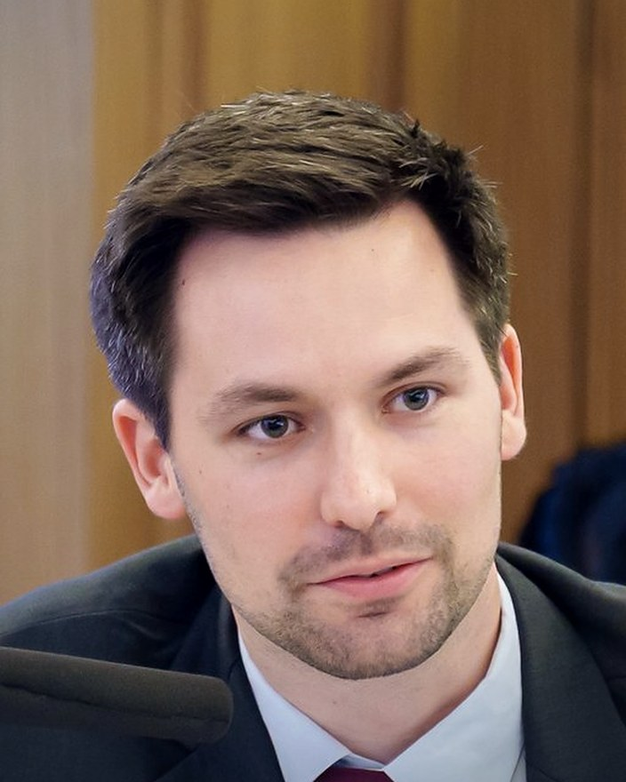

```{=html}
<div class="home-intro">
<picture class="home-photo">
<source srcset="images/profile.webp" type="image/webp">

</picture>
<div class="home-id">
<h1>Tim Dobermann</h1>
<p class="home-positions">Chief Economist, <a href="https://www.theigc.org/">International Growth Centre (IGC)</a><br>Research Fellow, Department of Economics, <a href="https://www.lse.ac.uk/">London School of Economics (LSE)</a></p>
<p class="home-links"><a href="mailto:t.dobermann@lse.ac.uk">t.dobermann@lse.ac.uk</a> · <a href="tim-dobermann-cv.pdf">CV</a> · <a href="https://scholar.google.com/citations?user=QSNCu9UAAAAJ">Google Scholar</a> · <a href="https://www.theigc.org/people/tim-dobermann">IGC profile</a> · <a href="https://www.linkedin.com/in/timdobermann/">LinkedIn</a></p>
</div>
</div>
```

I am an economist working on AI, development, and environmental economics. My research asks how energy systems, climate change, and new technologies like AI shape structural transformation, and how institutions can manage those transitions. I work with field experiments, administrative data, and quantitative models, mostly on projects in South Asia and sub-Saharan Africa, in partnership with the utilities, revenue authorities, and ministries that run the systems I study.

At the IGC I lead the global research portfolio and a team of more than twenty economists, and I advise governments across Africa, MENA, and Asia on [policies for sustainable economic growth](policy.qmd). I hold a PhD in Economics from LSE.

## Working papers

::: {.pubs .pubs-compact}
- [AI and the Ladder of Development](papers/ai-ladder-of-development.qmd){.pub-title}
- [Human Capital, Mobility, and the Unequal Effects of Climate Change](papers/human-capital-climate-mobility.qmd){.pub-title}
- [The Economic Costs of Lopsided Contracts: Evidence from Power Purchase Agreements in Pakistan](papers/economic-costs-lopsided-ppas-pakistan.qmd){.pub-title}
  [with [Faraz Hayat](https://farazhayat.com/) and [Sugandha Srivastav](https://www.sugandhasrivastav.com/)]{.pub-authors}
- [Pushing on a String? Price and Enforcement Interventions in Pakistan's Power Sector](papers/pushing-on-a-string-pakistan.qmd){.pub-title}
  [with [Robin Burgess](https://www.robinburgess.com/), [Michael Greenstone](https://michaelgreenstone.com/), [Faraz Hayat](https://farazhayat.com/), and [Usman Naeem](https://usman-naeem.com/)]{.pub-authors}
:::

## Work in progress

::: {.pubs .pubs-compact}
- [Deciphering the Miracle on the Han: How South Korea Escaped Poverty and Transformed its Economy](papers/miracle-on-the-han.qmd){.pub-title}
  [with [Oriana Bandiera](https://orianabandiera.github.io/), [Ignacio Bañares Sanchez](https://ignaciobanares.com/), [Robin Burgess](https://www.robinburgess.com/), [Jay Euijung Lee](https://www.jayeuijunglee.com/), Jeongkyung Won, and Hyunjoo Yang]{.pub-authors}
- [Electricity, Agglomeration, and Industrialisation in Ghana](papers/electricity-agglomeration-ghana.qmd){.pub-title}
  [with [Ignacio Bañares Sanchez](https://ignaciobanares.com/) and [Niclas Moneke](https://niclasmoneke.com/)]{.pub-authors}
:::

[Abstracts and ongoing field projects →](research.qmd){.more-link}
